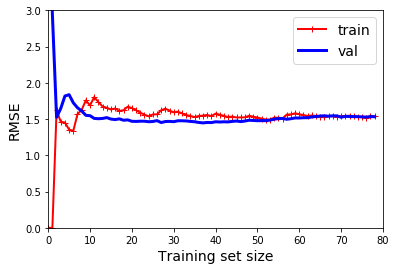

# Polynomial regression

You can actually use a linear model to fit nonlinear data. A simple way to do this is to add powers of each feature as new features, then train a linear model on this extended set of features. This technique is called Polynomial Regression.

For this, you just need to:
1. Add polynomial features: For example if you have two features, a and b, you would add a^2, b^2 and ab (the interation term)
2. Fit a normal linear regression model

## Add polynomial features


```python
m = 100
X = 6 * np.random.rand(m, 1) - 3
y = 0.5 * X** 2 + X + 2 + np.random.randn(m, 1)
```


```python
from sklearn.preprocessing import PolynomialFeatures
poly_features = PolynomialFeatures( degree = 2, include_bias = False)
X_poly = poly_features.fit_transform(X)
```


```python
X[0]
```


    array([2.30621604])


```python
X_poly[0]
```


    array([2.30621604, 5.31863244])

## Fit a normal linear regression model


```python
from sklearn.linear_model import LinearRegression
lin_reg = LinearRegression()
lin_reg.fit( X_poly, y)
lin_reg.intercept_, lin_reg.coef_
```


    (array([2.0623998]), array([[0.96367265, 0.45641915]]))

## Overfitting

If you perform high-degree Polynomial Regression, you will likely fit the training data much better than with plain Linear Regression. Beware of overfitting!

If a model performs well on the training data but generalizes poorly according to the cross-validation metrics, then your model is **overfitting**. If it performs poorly on both, then it is **underfitting**. This is one way to tell when a model is too simple or too complex.

Another way is to look at the learning curves: these are plots of the model’s performance on the training set and the validation set as a function of the training set size (or the training iteration).


```python
from sklearn.metrics import mean_squared_error
from sklearn.model_selection import train_test_split

def plot_learning_curves(model, X, y):
    X_train, X_val, y_train, y_val = train_test_split(X, y, test_size=0.2, random_state=10)
    train_errors, val_errors = [], []
    for m in range(1, len(X_train)):
        model.fit(X_train[:m], y_train[:m])
        y_train_predict = model.predict(X_train[:m])
        y_val_predict = model.predict(X_val)
        train_errors.append(mean_squared_error(y_train[:m], y_train_predict))
        val_errors.append(mean_squared_error(y_val, y_val_predict))

    plt.plot(np.sqrt(train_errors), "r-+", linewidth=2, label="train")
    plt.plot(np.sqrt(val_errors), "b-", linewidth=3, label="val")
    plt.legend(loc="upper right", fontsize=14)   
    plt.xlabel("Training set size", fontsize=14) 
    plt.ylabel("RMSE", fontsize=14)              
```


```python
import matplotlib.pyplot as plt
%matplotlib inline

lin_reg = LinearRegression()
plot_learning_curves(lin_reg, X, y)
plt.axis([0, 80, 0, 3])                        
plt.show()  
```





These learning curves are typical of an underfitting model. Both curves have reached a plateau; they are close and fairly high.
