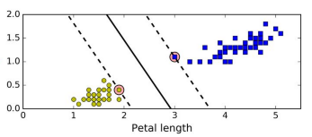

# Support vector machines

Support vector machines (SVM) are particularly suited for classification of complex but small or medium sized datasets.

## Linear SVM Classification

### General

Separate the two classes by a line that stays as far away from the training instances as possible, i.e. fit the widest possible street between the classes. This is called *large-margin classification*.

New training instances outside of the street will not affect the street itself, i.e. the decision boudary, as this boundary is fully determined by the training instances located right on the edge of the street. **These instances are called the support vectors**.



:exclamation: SVMs require features to be scaled.

### Hard margin classification

If we require that all instances are off the street, this is called **hard margin classification**. This is obviously only possible if the data is linearly separable. This is also mean that the street is quite sensitive to outliers (any instance on the street becomes a new support vector and the width of the street diminishes).

### Soft margin classification

**Soft margin classification** consist in finding the right balance between:

* Keeping the street as wide as possible
* Limiting margin violations

In Scikit-Learn this is controlled with the C hyperparameter (smaller C value => wider street but more margin violations):

```python
from sklearn.pipeline import Pipeline
from sklearn.preprocessing import StandardScaler
from sklearn.svm import LinearSVC

svm_clf = Pipeline([
        ("scaler", StandardScaler()),
        ("linear_svc", LinearSVC(C=1, loss="hinge", random_state=42)),
        ])

svm_clf.fit(X, y)
```

* Alternatively, you could use the `SVC` class, using `SVC( kernel =" linear", C = 1)`, but it is much slower, especially with large training sets, so it is not recommended.
* :exclamation: The `LinearSVC` class regularizes the bias term, so you should **center** the training set first by subtracting its mean. This is automatic if you scale the data using the StandardScaler.

## Non-linear SVM classification

### First approach: Add polynomial features

In some cases, adding polynomial features may result in a linearly separable dataset, however, adding high polynomial degrees quickly result in a huge number of features (and low polynomial degrees do not work well with very complex datasets), so the **kernel trick”** is used instead.

### Second approach: The kernel trick

The kernel trick makes it possible to get the same result as if you added many polynomial features, even with very high-degree polynomials, without actually having to add them. There is no combinatorial explosion of the number of features since you don’t actually add any features. This trick is implemented by the `SVC class`.

```python
from sklearn.svm import SVC

poly_kernel_svm_clf = Pipeline([
        ("scaler", StandardScaler()),
        ("svm_clf", SVC(kernel="poly", degree=3, coef0=1, C=5))
    ])
poly_kernel_svm_clf.fit(X, y)
```

Essentially, the kernel function defines **dot products** in the transformed space without the need to actually map the features to this new space, which would increase the number of variables dramatically.

[Medium article](https://towardsdatascience.com/truly-understanding-the-kernel-trick-1aeb11560769)
