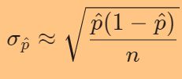
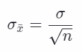
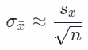
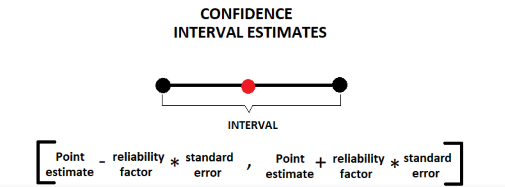
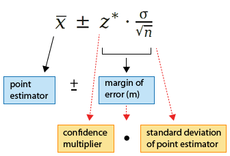

# Inferential statistics

## Estimators

Estimation is the process used to make inferences, from a sample, about an unknown population parameter.

In Statistics, to infer the value of an unknown parameter we use **estimators**. 

For example, the sample mean ($\bar x​$) is a point estimation of the population’s mean ($\mu​$). The same goes for the sample variance ($s^2​$) which is an estimate of the population’s variance ($\sigma​$).

All estimators have two properties, **efficiency** and **bias**:

- **Bias** — an unbiased estimator has an expected value equal to the population parameter.
- **Efficiency** — the most efficient estimators are the ones with the least variability of outcomes.

## Confidence interval

### Definition

- The confidence level refers to the **long-term success rate** of the method, that is, how often this type of interval will capture the parameter of interest.
- A specific confidence interval gives a **range of plausible values** for the parameter of interest.
- We say "We are 95% confident that the interval (a, b) captures the true mean of the population".
- For hypothesis testing purposes, if the interval contains the null hypothesis value of the parameter, we cannot reject it.

### Conditions for calculating a confidence interval

#### Parameter: proportion

- **Random**: simple random sample
- **Normal**: the sampling distribution of the proportion needs to be approximately normal: This should be true if the number of expected successes and expected failures is at least 10 (for both)
- **Independent**: if sample was drawn without replacement, the sample must not represent more than 10% of the total population

:warning: Independence allows to calculate standard error as  with $n$ = sample size and $\hat p$ = hypothesized value of p.

#### Parameter: mean

- **Random**: simple random sample

- **Normal**: the sampling distribution of the mean needs to be approximately normal. This should be      true if:

  - the parent population is normal
  - sample size >=30 (by virtue of the CLT)
  - 
    sample size <30 but the sampling distribution of the mean is roughly symmetric, has no outliers nor big skews

- **Independent**: if sample was drawn without replacement, the sample must not represent more than 10% of the total population

  

:warning: Independence allows us to calculate the standard deviation of $\bar x$ (using the population standard deviation $σ$):  or the **standard error** of $\bar x$ (using the sample standard error $s$) if we do not know the population standard deviation $σ$: ($n$ = sample size, $s_x$ = sample standard error)

:heart: **Reminder** - sample standard error formula: 

###  Calculation of a confidence interval

There are two situations when it is possible to calculate a confidence interval:

1. When the population variance is known: Use of the normal distribution for the reliability factor (**z-stat**)

2. When the population variance is unknown: Use of the Student’s T distribution for the reliability factor (**t-stat**). It has a similar shape as the normal distribution but fatter tails which allow for higher dispersion of variables as there is more uncertainty.

   [More on t-score vs z-score](https://www.statisticshowto.datasciencecentral.com/probability-and-statistics/hypothesis-testing/t-score-vs-z-score/)

