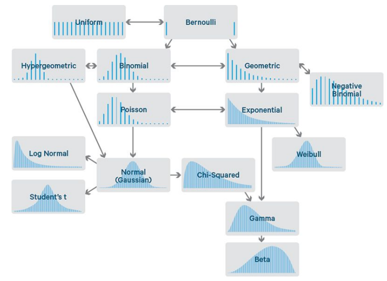
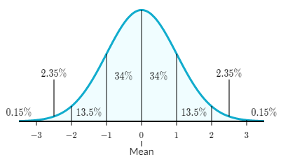

# Probability distributions

## General

### Random variables

A **random variable**, often noted $$X$$, is a function that maps every element in a sample space to a real line.

#### Probability mass functions (PMF)

A **probability mass function** is a function that gives the probability that a <u>discrete</u> random variable is exactly equal to some value, i.e. $$P(X=x)$$.

A probability mass function differs from a **probability density function** in that the latter is associated with <u>continuous</u> rather than discrete random variables. The values of the PDF are not probabilities as such: a PDF must be integrated over an interval to yield a probability.

#### Probability density functions (PDF)

The **probability density function** is used to specify the probability of the <u>continuous</u> random variable falling *within a particular range of values*, as opposed to taking any one value. This probability is given by the integral of this variable's PDF over that range.

The probability density function is nonnegative everywhere, and **its integral over the entire space is equal to one**.

A single point gives an expected **frequency**, if large number of repetitions.

#### Cumulative distribution functions (CDF)

The **cumulative distribution function** is a function that gives the probability that a random variable will take a value less than or equal to $$x$$, i.e. $$P(X \leq x)$$.

### Expectation and Moments of the Distribution

**Expected value** ― The expected value of a random variable, also known as the mean value or the first moment, is often noted $$E[X]​$$ or $$\mu​$$ and is the value that we would obtain by averaging the results of the experiment infinitely many times.

**Variance** ― The variance of a random variable, often noted Var(X) or \sigma^2, is a measure of the spread of its distribution function. It is determined as follows:

​	$$\mbox{Var}(X)=E[(X-E[X])^2]=E[X^2]-E[X]^2​$$

**Standard deviation** ― The standard deviation of a random variable, often noted \sigma, is a measure of the spread of its distribution function which is compatible with the units of the actual random variable. It is determined as follows:

​	$$\sigma=\sqrt{\mbox{Var}(X)}$$

## Common distributions

### Discrete probability distributions


```python
import scipy.stats as st
# Discrete uniform
prob = st.randint.pmf(k, low, high)
cum_prob = st.randint.cdf(x, low, high)
# Bernoulli
prob = st.bernoulli.pmf(k, p)
cum_prob = st.bernoulli.cdf(x, p)
# Binomial
prob = st.binom.pmf(k, n, p)
cum_prob = st.binom.cdf(x, n, p)
# Poisson
prob = st.poisson.pmf(k, mu)
cum_prob = st.poisson.cdf(x, mu)
# Geometric
prob = st.geom.pmf(k, p)
cum_prob = st.geom.cdf(x, p)
# Negative binomial
prob = st.nbinom.pmf(k, n, p)
cum_prob = st.nbinom.cdf(x, n, p)
#Hypergeometric
prob = st.hypergeom.pmf(k, M, n, N)
cum_prob = st.hypergeom.cdf(x, M, n, N)
```

### Continuous probability distributions


```python
import scipy.stats as st
# Normal
prob = st.norm.pdf(x, loc=0, scale=1) # default is standard normal
cum_prob = st.norm.cdf(x, loc=0, scale=1)
# Etc. Read SciPy documentation.
```

### Relationship between distributions



## More on the normal distribution

The probability density function of the normal distribution is as follows:



Notation: $${\mathcal {N}}(\mu ,\sigma ^{2})$$

Normal distributions have the following features:

- symmetric bell shape
- mean and median are equal
- $$\approx68\%$$ of the data falls within 1 standard deviation of the mean
- $$\approx95\%$$ of the data falls within 2 standard deviations of the mean
- $$\approx99.7\%$$ of the data falls within 3 standard deviations of the mean

:information_source: The normal distribution is also called **Gaussian** distribution or Laplace-Gauss distribution.

The normal distribution with $$\mu = 0$$ and $$\sigma = 1$$ is called the **standard normal distribution**.

The following table gives the quantile $$z_p$$ such that $${\displaystyle X\sim {\mathcal {N}}(\mu ,\sigma ^{2})}$$ will lie in the range $$\displaystyle \mu \pm z_{p}\sigma$$ with a specified probability $$p$$:

| $$p$$  | $$z_p$$ |
| :--: | :---: |
| 0.80 | 1.282 |
| 0.90 | 1.645 |
| 0.95 | 1.960 |
| 0.98 | 2.326 |
| 0.99 | 2.576 |

```python
import scipy.stats as st
st.norm.ppf(.95) # 1.6448536269514722
st.norm.cdf(1.64) # 0.94949741652589625
```

### Skewness

**Normal distribution**: Not skewed in any direction

**Positive skew**: The distribution has a long tail in the positive direction or to the right

**Negative skew**: The distribution has a long tail on the negative direction or the the left