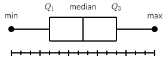

# Summary statistics

## Central tendency

### Mean

Also called **average**. The sum of all values divided by the number of values.

​	$mean=\frac{\sum_{k=1}^n x_i}{n}$c

- $\mu$ is the mean of the **population**
- $ \bar{x}$ is the mean of the **sample**

```python
import numpy
numpy.mean()

import scipy
scipy.mean()

import statistics
statistics.mean()
```

**When to use?** Quantitative variables with symmetric distribution.

### Median

The value separating the higher half of the sample from the lower half, aka as middle quantile or **50th percentile**.

You need to order to data values in increasing or decreasing order and if the number of data points is: 

* **Odd**: Take the middle value
* **Even**: Take the average of the two middle values.

```python
import numpy
numpy.median()

import statistics
statistics.median()
```

**When to use?** Quantitative variables when the distribution contains outliers.

### Mode

The most frequent number—that is, the number that occurs the highest number of times.

```python
import statistics
statistics.mode()
```

**When to use?** Categorical data. Not recommended as only measure of central tendency.

## Quantiles and percentiles

The **percentile rank** is the percentage of values in a distribution that are less than or equal to a given value (e.g. 50% for the 50th percentile).

The **percentile** is the value associated with a given percentile rank (e.g. the 50th percentile).

The **quantiles** are a sequence of values that correspond to equally spaced percentile ranks (e.g. the quartiles of a distribution are the 25th, 50th and 75th percentiles).

## Range and interquartile range (IQR)

The **range** represents how far apart the lowest and the highest measurements were that week.

The **IQR** approximates the amount of spread in the middle half of the data points, i.e it is the difference between the upper quartile (the median of the data above the median) and the lower quartile (the median of the data below the median).

​	$\text{IQR}={Q_3}-{Q_1}$

## Outliers

A commonly used rule says that a data point is an **outlier** if it is more than $1.5\cdot \text{IQR}​$ above the third quartile or below the first quartile. Said differently, low outliers are below $\text{Q}_1-1.5\cdot\text{IQR}​$ and high outliers are above $\text{Q}_3+1.5\cdot\text{IQR}​$.

## Whisker plots 

They are also called **boxplots**.



## Variance and standard deviation

The standard deviation measures the **dispersion around the mean** in the same unit as the unit of the data points. 

The formula for the **population** standard deviation is:

​	$\sigma=\sqrt{\dfrac{\sum{(x_i-\mu)^2}}{N}}​$

​	where: 

​	$N$ is the number of data points in the population

​	$\mu$ is the mean of the population

The formula for the **sample** standard deviation is:

​	$s=\sqrt{\dfrac{\sum{(x_i-\bar{x})^2}}{n-1}}$	

​	where: 

​	$n$ is the number of data points in the sample

​	$\bar{x}$ is the mean of the sample

The **variance** is the squared standard deviation, i.e. $\sigma^2​$ or $s^2​$.

## Standard error

The standard error is an **estimate of the standard deviation of the sampling distribution**, i.e. the set of *all* samples of size n that can be taken from a population.

It reflects the extent to which a statistic changes from sample to sample.

* For a mean: 

  $SE = s /\sqrt{n}​$

* For the difference between two means:

  $SE = \sqrt{s_1^2/n_1 + s_2^2/n_2}​$

  or, assuming equal variances, $SE = s / \sqrt{n_1 + n_2}​$

## z-score

A z-score measures exactly how many standard deviations above or below the mean a data point is.

​	$z=\dfrac{x-\mu}{\sigma}$

Here are some important facts about z-scores:

- A positive z-score says the data point is above average.
- A negative z-score says the data point is below average.
- A z-score close to 0 says the data point is close to average.
- A data point can be considered unusual if its z-score is above 3 or below -3


$P\left(\hat{p} < 0.85\right)=P\left(z<\dfrac{\hat{p}-p}{\sqrt{\dfrac{p\left(1-p\right)}{n}}}\right)$